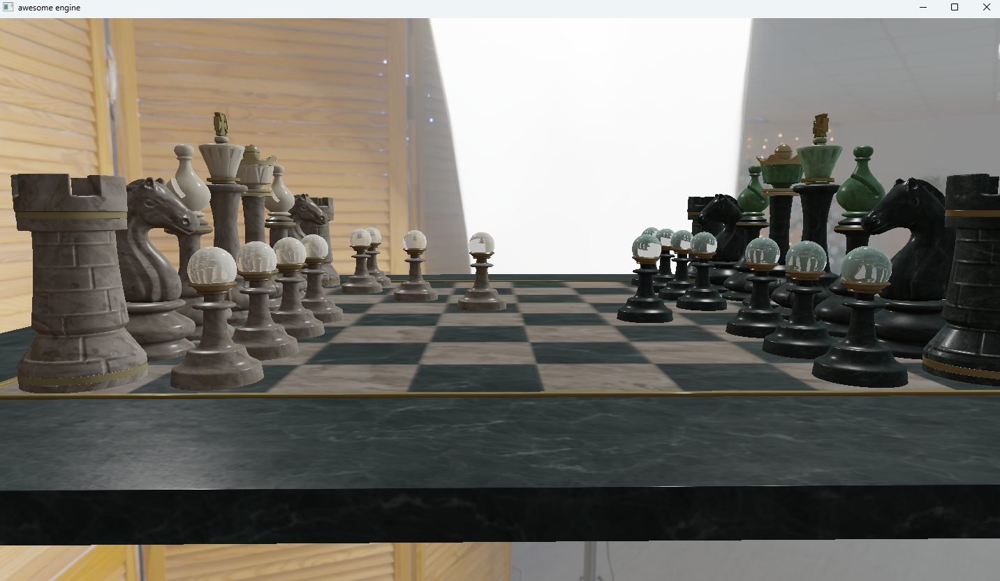

#### (Mainly OpenGL but does basic lighting with Vulkan) Renderer I'm making as a means to learn computer graphics/rendering

----

----

### Current OpenGL capabilities
- [x] PBR shading (metal/rough)
- [x] glTF 2.0 loading
- [50%] KHR_materials_transmission
- [x] KHR_materials_volume
- [x] IBL from environment map
- [x] Depth-peel compositing for transmission/volume
- [ ] Proper specular IBL / BRDF LUT
- [ ] Shadows

### General TODO
- [ ] Make it easy to build cross platform
- [ ] Switch backends during runtime
